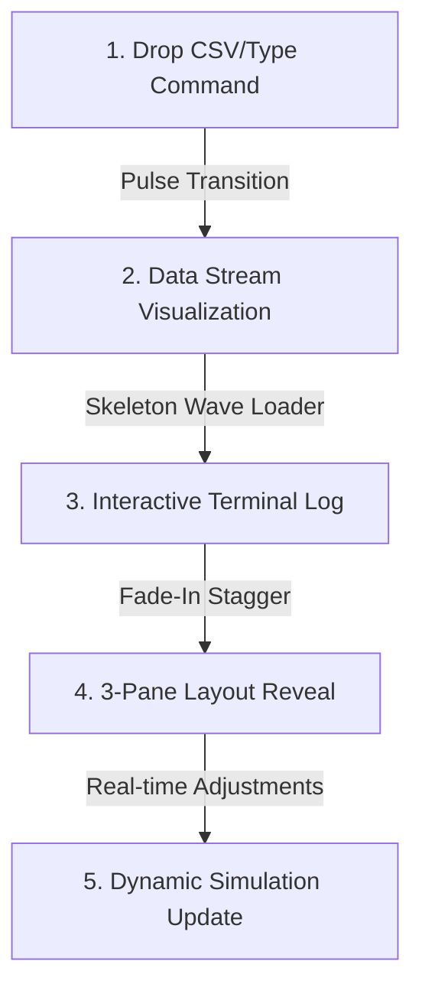

# MarketPulse-AI

MarketPulse-AI is a high-fidelity, human-centered SaaS and AI web application designed for market regime detection, stock forecasting, and portfolio optimization. This document outlines the comprehensive UI/UX design blueprint, serving as the production-ready specification for the capstone project frontend.

---

## 1. Design System & Aesthetic Archetype

To stand out during the capstone defense, MarketPulse-AI rejects generic, over-designed "cyberpunk neon dashboards" in favor of a **Sophisticated Editorial Light Mode**—inspired by systems like Stripe, Linear, and Vercel. The interface prioritizes clean layout lines, high-contrast typography, generous whitespace, and subtle micro-interactions.

### Theme & Mood: "Muted Alabaster & Obsidian"
*   **Aesthetic**: Editorial, developer-grade precision, and high readability.
*   **Grid Structure**: `0.5px` border separations, minimal drop shadows, and strict geometric alignment.
*   **Atmosphere**: Professional financial research meets high-performance engineering tool.

### Color Palette
```
[Canvas Background]  #FAFAFA  (Pristine off-white)
[Card Backdrop]      #F4F4F5  (Muted zinc/gray)
[Primary Text]       #09090B  (Obsidian Ink)
[Accent Core]        #0066FF  (Precision Cobalt Blue)
[Muted Text]         #71717A  (Zinc Gray)
[Borders & Lines]    #E4E4E7  (Soft zinc border)
```

#### Semantic Indicators (Market Regimes):
*   **Bullish / Stable**: `#059669` (Emerald Mint - positive momentum)
*   **Volatile / Drift Alert**: `#D97706` (Burnt Amber - warning state without being visually chaotic)
*   **Bearish / Risk Event**: `#DC2626` (Crimson Slate - risk mitigation)

### Typography
*   **Headers & Titles**: `Outfit` (Google Fonts) – A geometric, modern sans-serif with clean terminal curves that gives a premium tech feel.
*   **Body Text & Labels**: `Inter` or `SF Pro` – Optimized for readability at small sizes and high-density information.
*   **Data Values & Code**: `Geist Mono` or `JetBrains Mono` – A beautiful monospace font that ensures all numerical values, confidence scores, and code tokens align in tabular columns.

---

## 2. User Journey & "Hero" Interaction Flow

The interaction model is designed to feel alive, predictable, and exceptionally responsive.



### Step-by-Step Flow:
1.  **Ingestion Initiation**: The user lands on a clean, single-input hub. 
2.  **Visual Upload Drop**: Dragging a CSV file onto the input hub prompts a transition where the border shifts to `#0066FF` with a subtle dashed dash-array animation.
3.  **Parsing Feedback**: The dropzone transitions to show the ingested file headers sliding upward. An inline console prints: `[parse] Ingested 12 columns, 4,200 rows of market data. Executing LSTM Ensemble...`
4.  **AI Calculation Loop**: The middle workspace uses a high-performance **Skeleton Wave Loader**—rather than a spinning wheel, sections of the layout gently pulse in brightness, signaling async progress.
5.  **Layout Reveal**: Once analyzed, the dashboard reveals itself using a slide-and-fade entry (`cubic-bezier(0.16, 1, 0.3, 1)`) from bottom to top.

### Micro-Interactions:
*   **Interactive Buttons**: Hovering over action controls causes a slight depth change using a `1px` offset translation (`transform: translateY(-1px)`) and a subtle background transition to white with `#0066FF` text.
*   **Live Charts**: When switching tabs, charts do not snap into place; lines draw themselves using SVG path length stroke animations (`stroke-dashoffset`), taking exactly `600ms`.

---

## 3. Creative Page Layout & Interface Sections

The screen is organized into a highly structured, non-grid-locked **3-Pane Editorial Layout**.

```
+-----------------------------------------------------------------------------------+
|  [01] INPUT HUB                                                                   |
|  Command Prompt: /predict --asset SQPHARMA --scenario optimistic [Drop File Area] |
+---------------------------------------------------+-------------------------------+
|                                                   |                               |
|  [02] ANALYTICS & INSIGHTS CANVAS                 |  [03] REAL-TIME DRIFT LIST    |
|                                                   |  Drift Score: 79.3 CRITICAL   |
|  +---------------------------------------------+  |  Alert Level: LEVEL 3 OF 5    |
|  |  Scenario Forecast Graph (Optimistic/Neutral)|  |                               |
|  |                                             |  |  [Regime Shift History]       |
|  |  * Interactive slider changes trajectory    |  |  - Jan 15: Structural Break   |
|  +---------------------------------------------+  |  - Jan 08: Sector Shift       |
|                                                   |                               |
+---------------------------------------------------+-------------------------------+
|  [04] FEEDBACK & ACTION BAR                                                       |
|  Recommendation: REDUCE EXPOSURE [87% Conf]               [Deploy to Webhook]     |
+-----------------------------------------------------------------------------------+
```

### Section A: The Input Hub (Top Navigation & Control Bar)
*   **Placement**: Anchored at the top, full width, with a thin bottom border (`#E4E4E7`).
*   **Interactive Elements**:
    *   Left side: A text input styled like a command palette. Placeholder: `Type command (e.g., /regime SQPHARMA) or drop dataset here...`
    *   Right side: A status pill that states `● SYSTEM ONLINE - DSE COMPILATION RUNNING`.
*   **Design Details**: Monospace font for inputs to make commands look precise.

### Section B: The Analytics & Insights Canvas (Left Main Pane)
*   **Placement**: Occupies 70% of the horizontal screen estate below the Input Hub.
*   **Visualization Elements**:
    *   **The Regime Transition Plane**: Instead of a boring grid of charts, this is a 2D coordinate system mapping "Volatility" against "Trend Strength". The active stock status is represented as a floating node with a dotted historical drift tail.
    *   **The Scenario Forecast Timeline**: A multi-colored line graph displaying three projections:
        *   Green Solid line: Optimistic Projection (+6.2% expected)
        *   Blue Dotted line: Neutral Projection (+1.9%)
        *   Red Solid line: Risk / Bearish Projection (-3.1%)
*   **Design Details**: Uses smooth SVG path rendering, minimal grid lines, and interactive hover tooltips styled with a white background and thin border.

### Section C: The Drift & History Log (Right Side Pane)
*   **Placement**: Occupies 30% of the screen width on the right.
*   **Content**:
    *   **Drift Score Gauge**: An elegant radial arc display showing `79.3 / 100` in Amber.
    *   **Historical Regime Shifts**: An vertical timeline showing a list of recent structural breaks (e.g., `Jan 15: Volatility regime transition detected`).
*   **Design Details**: Extremely dense, clean, and textual. It uses small fonts (`11px` Inter) with monospace telemetry values.

### Section D: The Feedback / Action Bar (Sticky Footer)
*   **Placement**: Fixed at the bottom of the viewport.
*   **Interactive Elements**:
    *   Left side: Final AI model output: `REDUCE EXPOSURE` highlighted in Amber, accompanied by `AI CONFIDENCE: 87.4%` in monospace.
    *   Right side: A primary button labeled `Deploy Allocation Model` and a secondary button `Export Telemetry (JSON)`.
*   **Design Details**: Slightly frosted blur backdrop (`backdrop-filter: blur(8px)`) that overlaps the analytics canvas as the user scrolls, creating premium layered depth.

---

## 4. "Wow-Factor" Features for Defense Presentation

These two creative modules are engineered to stand out during the live capstone defense.

### Feature 1: The Interactive Scenario Simulator Sandbox
*   **How it works**: Hovering over the Forecast Graph opens a slide-out panel on the left with three micro-sliders:
    1.  `Market Volatility Coefficient` (Slider from `0.0` to `1.0`)
    2.  `Sentiment Bias` (Slider from `-1.0` to `+1.0`)
    3.  `Systemic Drift` (Slider from `0.0` to `2.0`)
*   **Presentation Impact**: The presenter can adjust the sliders live, and the three scenario forecast lines will recalculate and animate in real-time, showing the AI adjusting to mock stress testing.

### Feature 2: Live Inference Terminal Log
*   **How it works**: A small toggle at the bottom of the page opens an overlay terminal displaying the real-time pipeline output. It prints live logs like:
    ```
    [INFO] Fetching DSE sentiment index weights...
    [MODEL] Running PyTorch LSTM ensemble forward pass.
    [DRIFT] Volatility Drift Index exceeds threshold: 64.2 > 60.0.
    [ACTION] Recalculating portfolio allocations to balance risk.
    ```
*   **Presentation Impact**: Proves to the examiners that the AI engine is actively calculating backend regressions rather than displaying hardcoded screenshots.

---

## 5. Repository Setup Instructions

To initialize the project directory and synchronize with GitHub:

1. Create a `README.md` containing this UX specification.
2. Initialize Git, commit, and link the remote.
3. Push to main:
   ```bash
   git init
   git add README.md
   git commit -m "docs: initialize MarketPulse-AI repository and UX blueprint"
   git branch -M main
   git remote add origin https://github.com/TechySakib/MarketPulse-AI.git
   git push -u origin main
   ```
